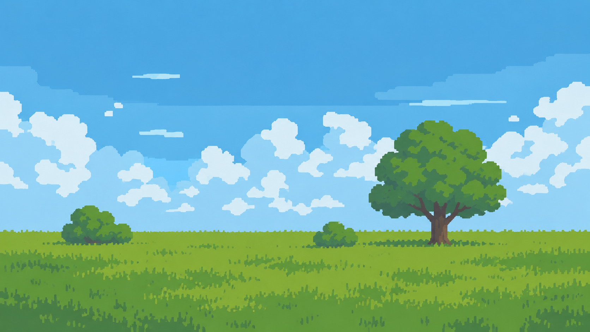
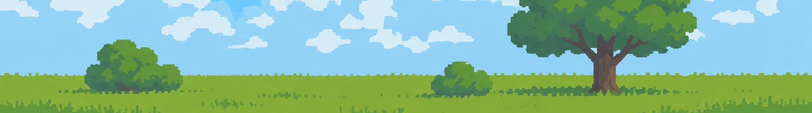
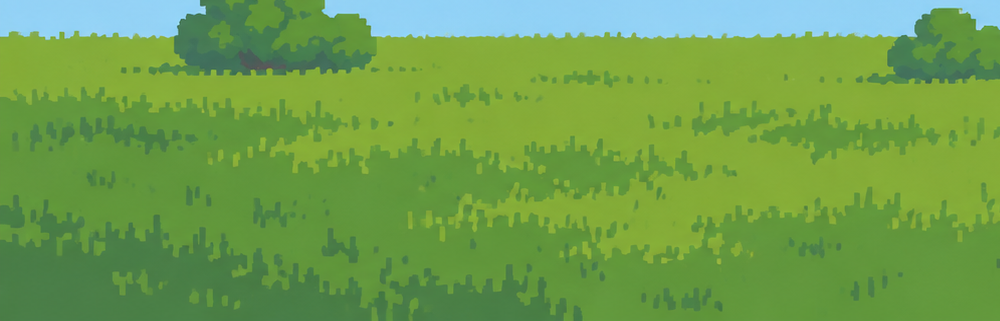
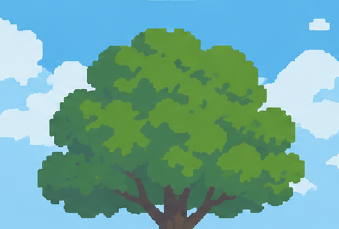
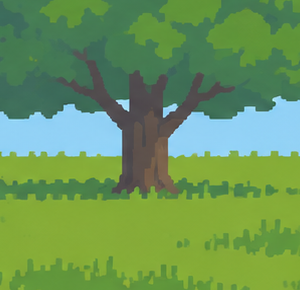
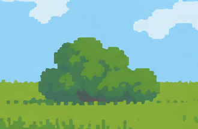
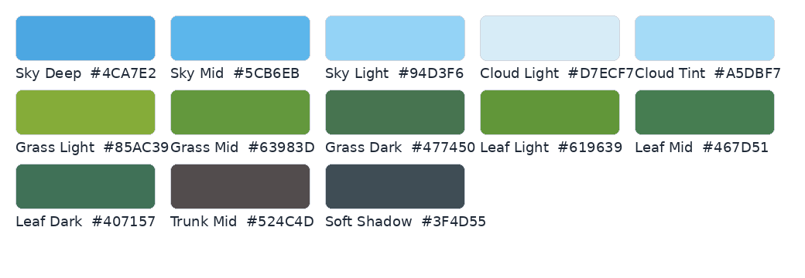

# design.md — Pixel Meadow Environment Asset Pack

> **Purpose:** This document is the visual source of truth for recreating the environment style shown in `references/reference_full.png` as a reusable 2D sprite/FX asset pack.  
> **Primary priority:** **match the reference image before adding detail.** Readability, shape language, palette discipline, and calm layered atmosphere matter more than realism.



---

## 0. Non-negotiable art direction

The target is a **flat-shaded, painterly-pixel hybrid**: large, simplified, slightly blocky silhouettes; soft color grouping; sparse texture marks; and no visible line-art dependency. It should feel like a polished 2D game background painted with chunky digital brushes rather than strict 8-bit/16-bit pixel art.

The environment must remain **open, calm, horizontal, and readable**. The reference is not trying to simulate realistic terrain depth. It uses a low, almost flat horizon, broad sky, clean meadow bands, and a small number of strong silhouettes.

### The style must always preserve these traits

- **No mountains, hills, cliffs, or dramatic terrain silhouettes** unless a future scene brief explicitly overrides this guide.
- **No photorealism.** Never use realistic bark, photographic grass, lens effects, depth-of-field blur, or noisy texture maps.
- **No heavy outlines.** Objects are separated by hue/value contrast and silhouette, not black contour lines.
- **No high-frequency detail.** Texture is clustered and sparse.
- **No individual leaf rendering.** Trees and bushes are built from grouped foliage masses.
- **No smooth airbrushed gradients on objects.** Shading is made from solid or near-solid color regions.
- **No muddy/desaturated palette.** The world is bright, clean, fresh, and slightly saturated.
- **No clutter.** Empty sky and open grass are intentional parts of the composition.

---

# 1. Reference breakdown

The screenshots below are direct crops from the approved reference. Treat them as visual tests: new assets should look as though they could be dropped into these crops without appearing to come from another art pack.

## 1.1 Layered sky bands


**Observed style**

- The sky is made from broad cyan/blue value families rather than a realistic gradient.
- Changes in value are very soft and wide; they read almost like horizontal painted bands.
- The upper sky is deeper and cleaner; the lower sky becomes paler and more atmospheric.
- Tiny horizontal cloud streaks help break empty areas without filling them.
- Avoid grain, stars during daytime, noise overlays, film texture, or cloud haze that obscures shape clarity.

**Implementation rule:** if using procedural rendering, prefer 3–5 wide vertical/height-based color bands with very gentle interpolation between them. The result should still read as **flat color zones**, not a glossy gradient.

---

## 1.2 Cloud language


Clouds are one of the strongest identifying features of the style.

### Shape

- Build clouds as **clusters of rounded, chunky lobes**.
- Lobes should feel irregular and hand-placed, not mathematical circles.
- Large clouds are assembled from several overlapping masses with stepped/blocky edges.
- Favor horizontally stretched forms over tall storm columns for ordinary weather.
- Preserve negative space between cloud groups.

### Shading

Use **2–3 tones maximum per cloud**:

1. bright top/front mass;
2. pale cyan underside or interior shadow;
3. optional faint atmospheric blue for distant clouds.

Do not outline clouds. Do not use gray thundercloud shading unless the weather state calls for it.

### Depth hierarchy

Create at least three cloud families:

- **Far clouds:** pale, low contrast, smaller, slower.
- **Mid clouds:** normal contrast and normal size.
- **Near clouds:** larger silhouettes, slightly stronger cyan underside, faster parallax.

Clouds should never all move at identical speed.

---

## 1.3 Flat horizon and background meadow



- Horizon is **low and nearly straight**.
- The distant grass strip is simple and lightly textured.
- The horizon is not a hard ruler line: tiny grass pixels/marks create a soft organic edge.
- Background assets use lower contrast and fewer tones than foreground assets.
- The scene remains horizontally calm. Avoid strong diagonals unless used for temporary wind/rain FX.

**Key proportion from reference:** sky visually dominates the frame. As a default composition, target roughly **60–70% sky / 30–40% ground**, depending on camera and gameplay needs.

---

## 1.4 Grass texture language



Grass is not rendered blade-by-blade. The field is built from **large green masses plus clustered micro-marks**.

### Base construction

1. Fill with one dominant mid/light green.
2. Add broad irregular patches in a neighboring green.
3. Add small groups of short vertical/angled marks.
4. Leave large areas untouched.

### Texture mark rules

- Marks are short, rectangular, slightly blocky, usually vertical or mildly angled.
- Group marks in clusters of 3–12 rather than distributing them evenly.
- Alternate light and dark clusters.
- Avoid one-pixel salt-and-pepper noise.
- Avoid realistic individual grass blades with tapering tips.
- Foreground grass can use more marks than background grass, but should remain visually quiet.

---

## 1.5 Tree canopy language



Tree canopies are built as **large overlapping foliage masses**, not leaves.

### Canopy structure

- Start with a strong overall silhouette: broad, rounded, asymmetric.
- Break the silhouette into 5–12 large lobe groups.
- Use 3 principal values: light, mid, dark.
- Place highlights as chunky patches on upper/outward-facing masses.
- Place shadow masses inside/under the canopy and near trunk intersections.
- Do not evenly speckle highlight pixels across the tree.
- Preserve holes/indentations only where they improve silhouette; do not create lace-like foliage.

The canopy should still read clearly when reduced to a small thumbnail.

---

## 1.6 Trunk language



- Trunks are simplified, chunky, and wider than a realistic thin sapling.
- Branches are shown only when they support the canopy silhouette.
- Use 2–4 broad value shapes rather than bark texture.
- Darkest areas sit under branch junctions and on the shadow side.
- Small vertical bark marks are allowed sparingly, but never become a repeating texture pattern.
- The trunk base can merge softly into nearby grass clusters.

---

## 1.7 Shrub / bush language



Bushes use the same foliage logic as trees but with lower, denser silhouettes.

- 2–4 color tones.
- Rounded, irregular top contour.
- Dark mass usually sits lower/inside the bush.
- No visible branch network unless the bush is leafless.
- Keep a readable base and do not blur it into the ground.

---

# 2. Color system



These are **anchor colors sampled/derived from the approved reference**. They are not a requirement that every asset use every exact hex value. Keep each asset inside the same family and allow only small controlled shifts for weather, time of day, depth, and variation.

| Family | Anchor | Use |
|---|---:|---|
| Sky Deep | `#4CA7E2` | upper/day sky |
| Sky Mid | `#5CB6EB` | primary sky body |
| Sky Light | `#94D3F6` | lower atmosphere / distant cloud interaction |
| Cloud Light | `#D7ECF7` | cloud highlight/body |
| Cloud Tint | `#A5DBF7` | cloud underside / distant atmospheric tint |
| Grass Light | `#85AC39` | sunlit meadow and highlight patches |
| Grass Mid | `#63983D` | main grass texture mass |
| Grass Dark | `#477450` | clustered grass shadow / horizon accents |
| Leaf Light | `#619639` | foliage highlight masses |
| Leaf Mid | `#467D51` | foliage body |
| Leaf Dark | `#407157` | canopy interior / deep foliage shadow |
| Trunk Mid | `#524C4D` | trunk base family |
| Soft Shadow | `#3F4D55` | deepest neutralized environment shadow |

## Palette discipline

- Normal object families use **2–4 tones**.
- Prefer hue-shifted shadows rather than simply adding black.
- Bright assets should remain slightly cool/clean rather than yellowed.
- Avoid pure black (`#000000`) for ordinary world shadows.
- Avoid pure white (`#FFFFFF`) for clouds except very small highlights.
- Avoid neon colors unless the object is explicitly magical/UI-related.
- Weather/night variations should shift the **whole palette family together**, not recolor individual assets randomly.

---

# 3. Edge treatment and pixel language

This is **not strict retro pixel art**. Do not force every contour onto a tiny low-resolution grid. The image uses a pixel-like block vocabulary at a modern display resolution.

### Target edge character

- Silhouettes: chunky, simplified, stepped in places.
- Edges: clean; slight anti-aliasing is acceptable.
- No soft Gaussian blur around sprite edges.
- No vector-perfect geometric smoothness on organic objects.
- No 1 px black contour.
- Internal shape edges should be at least as chunky as outer silhouettes.

### Texture scale

At a 1920×1080 presentation reference:

- tiny ambient mark: ~2–6 px;
- grass mark: ~3–10 px high;
- small leaf/flower detail: ~4–16 px;
- canopy highlight patch: ~12–60 px;
- large cloud lobe: ~40–200 px.

Scale these proportionally if the game renders at another base resolution.

---

# 4. Lighting and shading model

The reference uses **shape-based diffuse lighting**, not realistic material response.

### Default light direction

Use a soft daylight assumption from **upper-left / upper-front** unless a scene-specific light source overrides it.

### Shading rules

- 1 base tone + 1 shadow tone is enough for tiny sprites.
- 1 base + 1 light + 1 shadow is ideal for most vegetation and props.
- A fourth deepest tone is allowed only for large trees/logs/rocks.
- Shadows are broad solid masses.
- Avoid gradients inside rocks, logs, leaves, trunks, flowers, etc.
- No specular highlights on ordinary foliage.
- Wet/rain assets may gain a subtle cooler highlight but still remain flat-shaded.

### Ambient depth

Objects further back should become:

- slightly lighter;
- slightly bluer/cooler;
- less contrasty;
- less textured;
- slower in parallax.

Do not use blur as the main depth cue.

---

# 5. Four-layer scene architecture

The entire environment should be authored so assets can be composited into exactly four logical layers.

## Layer 1 — Sky / atmosphere / sun / moon / stars

**Role:** the slowest, largest-scale environmental layer.

Contains:

- base sky;
- sky bands / atmospheric color;
- dynamic clouds;
- sun;
- moon;
- stars;
- subtle distant haze;
- rain back-layer if needed;
- lightning glow if needed;
- distant weather particles.

### Rules

- No ground objects.
- Lowest parallax speed.
- Cloud groups should overlap without creating visual clutter.
- Celestial objects are simplified discs/shapes, not realistic photographs.
- Stars use small cross, diamond, square, or 2–4-pixel clusters—not realistic star fields.

Suggested parallax coefficient: `0.00–0.15` relative to camera movement.

---

## Layer 2 — Background grass layer

**Role:** distant meadow and horizon structure.

Contains:

- seamless background grass strip;
- distant grass texture;
- very small distant bushes/plant silhouettes if required;
- optional distant flower color flecks;
- soft horizon grass marks.

### Rules

- Keep contrast low.
- Keep the top silhouette nearly flat.
- Use fewer texture marks than foreground.
- Do not place hero trees here unless intentionally used as a distant landmark.
- This layer should tile seamlessly horizontally where possible.

Suggested parallax coefficient: `0.10–0.30`.

---

## Layer 3 — Foreground nature layer

**Role:** main environmental sprite layer and the richest part of the world.

Contains:

- foreground grass strips;
- grass tufts;
- trees;
- bushes/shrubs;
- flowers;
- loose leaves;
- falling leaves;
- wind wisps;
- pollen/dust;
- stones/pebbles;
- logs/stumps/cut wood;
- sticks;
- plants/ferns;
- mushrooms if needed;
- small environmental debris;
- front rain streaks;
- interaction props.

### Rules

- Highest silhouette clarity.
- Most contrast and texture, but still sparse.
- Assets should overlap naturally to hide repeating tile edges.
- Large assets must have alpha-safe padding.
- Tree bases, bushes, stones, and logs should include simple contact-shadow shapes when appropriate.

Suggested parallax coefficient: `0.30–1.00` depending on depth within this layer.

---

## Layer 4 — Front/UI layer

**Role:** interface and screen-space feedback.

Contains:

- HUD;
- health/stamina/weather indicators;
- inventory;
- dialogue frames;
- prompts/tooltips;
- status icons;
- cursor/selection effects;
- front-most screen-space weather accents if used.

### UI visual relationship to the world

UI must look like it belongs to the same game but must remain more readable than the environment.

- Use the same limited palette philosophy.
- Use chunky silhouettes and flat fills.
- UI can use a slightly darker neutral frame family for contrast.
- Avoid glossy gradients, glassmorphism, photorealistic textures, and ultra-modern thin-line iconography.
- Icons should remain legible at 16–48 px.
- World sprites should never overlap essential HUD text unless intentionally designed.

---

# 6. Asset pack specification

The following is the minimum recommended pack. Codex should favor **small coordinated variation sets** rather than hundreds of inconsistent one-offs.

## 6.1 Sky and atmosphere

| Asset | Variants | Suggested canvas | Notes |
|---|---:|---:|---|
| `cloud_far_*` | 6–10 | 128×64 to 256×128 | pale, low contrast |
| `cloud_mid_*` | 8–12 | 256×128 to 512×256 | primary cloud family |
| `cloud_near_*` | 4–8 | 384×192 to 768×384 | larger, stronger parallax |
| `cloud_streak_*` | 4–6 | 96×24 to 256×48 | thin horizontal atmospheric shapes |
| `sun_*` | 2–4 | 64×64 to 128×128 | clean disc, optional soft flat halo rings |
| `moon_*` | 4–8 | 64×64 to 128×128 | full/crescent variants, simplified |
| `star_*` | 8–16 | 8×8 to 24×24 | square/diamond/cross clusters |
| `star_cluster_*` | 4–8 | 64×32 to 192×96 | sparse grouped stars |
| `wind_wisp_*` | 8–12 | 64×24 to 256×64 | thin tapered chunky streaks |
| `rain_drop_*` | 4–8 | 4×16 to 12×48 | straight/slightly angled flat streaks |
| `pollen_*` | 6–10 | 4×4 to 12×12 | tiny muted light dots/short marks |

### Dynamic cloud design

For each size family, create silhouettes with meaningful differences:

- compact;
- elongated;
- split cluster;
- heavy base;
- sparse wispy edge;
- large hero cluster.

Do **not** generate variants by merely flipping the same sprite.

---

## 6.2 Grass and plants

| Asset | Variants | Suggested canvas | Notes |
|---|---:|---:|---|
| `grass_strip_bg_*` | 3–5 | 512×128 or 1024×192 | seamless horizontal tiles |
| `grass_strip_fg_*` | 4–6 | 512×192 or 1024×256 | richer texture, seamless |
| `grass_tuft_*` | 12–20 | 16×16 to 48×48 | grouped blades, not single hairlines |
| `flower_small_*` | 8–16 | 16×16 to 32×32 | 3–4 flower species/color families |
| `plant_leafy_*` | 8–12 | 24×32 to 64×96 | simple grouped leaves |
| `fern_*` | 4–8 | 32×48 to 64×96 | broad blocky fronds |
| `fallen_leaf_*` | 8–16 | 8×8 to 24×24 | several orientations |
| `falling_leaf_*` | 6–10 | 12×12 to 32×32 | animation-ready variants |

### Flower design

Flowers should be readable as **tiny color accents**, not botanical illustrations.

- 1 dark stem/leaf family;
- 1 flower body color;
- optional 1 lighter center/highlight;
- maintain chunky shape at small size;
- avoid thin stems below ~2 px at 1080p-equivalent scale.

---

## 6.3 Trees and bushes

| Asset | Variants | Suggested canvas | Notes |
|---|---:|---:|---|
| `tree_large_*` | 6–10 | 256×384 to 512×768 | hero silhouettes |
| `tree_medium_*` | 6–10 | 192×256 to 384×512 | common scenery |
| `tree_small_*` | 4–8 | 96×160 to 192×256 | secondary trees |
| `bush_large_*` | 6–10 | 128×96 to 256×192 | grouped foliage |
| `bush_small_*` | 8–12 | 64×48 to 160×96 | compositional fillers |
| `stump_*` | 4–8 | 48×48 to 128×128 | 2–4 broad tones |

Each tree variant must differ in:

- outer canopy silhouette;
- trunk split/lean;
- canopy mass distribution;
- height/width ratio;
- highlight/shadow patch placement.

Do not create a forest by duplicating the same tree with tint changes.

---

## 6.4 Stones, logs, and ground props

| Asset | Variants | Suggested canvas | Notes |
|---|---:|---:|---|
| `stone_small_*` | 8–12 | 16×16 to 48×40 | 2–3-tone simple silhouettes |
| `stone_medium_*` | 6–10 | 48×40 to 96×80 | broad planar shading |
| `stone_cluster_*` | 4–8 | 64×48 to 160×96 | grouped pebble clusters |
| `log_fallen_*` | 6–10 | 96×48 to 256×128 | chunky trunk sections |
| `log_cut_*` | 4–8 | 48×48 to 128×128 | simplified end rings, no fine texture |
| `stick_*` | 6–10 | 32×16 to 128×48 | readable silhouette |

### Stone shading

Use 2–4 large facets, not realistic grain. Rounded polygonal silhouettes are preferred. Cool green-gray/blue-gray shadows will usually harmonize better than neutral black.

### Log shading

Use large vertical/lengthwise shapes. Tree-ring detail should be simplified to 1–3 thick arcs at most.

---

# 7. Animation language

Movement should be **gentle, looping, readable, and low-frequency**. The environment is alive, not chaotic.

## 7.1 General motion principles

- Small loops: `2–6` key frames are usually enough.
- Favor eased motion over abrupt snapping except for tiny star twinkles.
- Different instances should use randomized phase offsets.
- Avoid all foliage moving in perfect sync.
- Avoid sub-pixel shimmer caused by continuous scaling/rotation of tiny sprites.
- Preserve the chunky silhouette while animating.

## 7.2 Recommended animation behavior

### Clouds

- Horizontal drift.
- Very slow scale change only for large clouds, if any.
- No bouncing.
- Far clouds move slowest.
- Spawn/despawn beyond camera bounds or dissolve using alpha over a long interval.

### Rain

- Straight or slightly angled streaks.
- Use 2–3 depth speeds.
- Front streaks are longer/faster; rear streaks are shorter/lighter.
- Avoid realistic refraction droplets unless used in UI/screen overlay.

### Wind wisps

- Curved horizontal/diagonal trails.
- Spawn as short segmented ribbons.
- Expand slightly, drift, then fade.
- Should visually echo the same blocky/painted edge style as clouds.

### Grass and flowers

- Sway by a very small amount: approximately 1–3 px at small sprite scale.
- Pivot near base.
- Use gentle asymmetry; do not mirror every frame.

### Falling leaves

- Slow downward arc.
- Side-to-side drift.
- Optional 2–4-frame orientation change.
- Keep rotation visually discrete enough to avoid blurry interpolation.

### Stars

- Subtle brightness or size pulse.
- Use sparse timing; not every star twinkles simultaneously.

### Sun/moon

Normally static. Any motion comes from the world/day-night system rather than sprite animation.

---

# 8. Day, night, and weather variants

Do not create completely different art styles for different conditions. Derive variants from the same shapes and palette logic.

## Clear day

Reference baseline. Bright cyan sky, white/cyan clouds, vivid green grass.

## Overcast

- compress sky contrast;
- shift sky toward cooler gray-blue;
- clouds use larger darker cyan masses;
- reduce grass highlight saturation slightly;
- retain clear silhouettes.

## Rain

- slightly darker/cooler global palette;
- clouds gain a deeper underside tone;
- rain streaks remain simple;
- wind wisps may increase in frequency;
- no cinematic heavy blur.

## Sunset / dawn

- keep flat-band sky logic;
- replace cyan bands with a controlled warm/cool ramp;
- preserve cloud shape language;
- grass can darken but should not become black silhouettes unless backlit intentionally.

## Night

- use deep blue/teal families rather than black;
- moon is a simple pale disc/crescent;
- stars remain sparse;
- foliage retains readable dark green/blue shapes;
- shadows should merge softly into a few broad masses.

---

# 9. Composition rules

The scene style depends as much on **where assets are placed** as on how they are drawn.

### Default composition

- Keep horizon low.
- Let sky breathe.
- Place one dominant tree or large natural form off-center.
- Use smaller shrubs to balance empty space.
- Avoid evenly spacing objects.
- Avoid symmetrical scene layouts.
- Use clusters separated by open negative space.

### Density rule

For a typical screen-width meadow scene:

- 1 hero tree **or** 2–3 medium trees;
- 2–5 bushes;
- 6–20 grass/flower clusters;
- 0–4 stones/logs depending on gameplay;
- clouds occupy roughly 20–45% of sky area, leaving clear blue regions.

These numbers are guidelines, not hard limits.

---

# 10. Sprite construction rules

## Transparent sprite assets

Every standalone asset should:

- use transparent PNG unless a vector/SVG source is intentionally retained;
- have clean alpha edges;
- include a small alpha-safe margin;
- avoid unintended semi-transparent halos;
- have no background color baked in;
- use a consistent origin/pivot convention.

### Recommended pivot conventions

- tree / bush / plant / stone / log: **bottom-center**;
- cloud: **center**;
- rain/wind FX: **center** or emitter-specific;
- falling leaf: **center**;
- sun/moon/star: **center**;
- UI icons: **center**.

## Tileable assets

For grass strips:

- left and right edges must tile seamlessly;
- avoid obvious repeating landmarks near tile edges;
- provide at least 3 compatible tile variants;
- use overlay tuft sprites to break repetition.

## Asset padding

Maintain enough transparent padding that animation, sway, or shader distortion does not clip the silhouette.

---

# 11. Naming convention

Use deterministic lowercase snake_case names.

```text
<layer>_<category>_<type>_<variant>[_<state>][_f##].png
```

Examples:

```text
l1_cloud_mid_01.png
l1_cloud_far_03.png
l1_wind_wisp_02_f01.png
l1_wind_wisp_02_f02.png
l1_rain_drop_near_01.png
l1_sun_clear_01.png
l1_moon_crescent_02.png
l1_star_cluster_04.png

l2_grass_strip_bg_01.png
l2_grass_strip_bg_02.png

l3_tree_large_01.png
l3_bush_small_07.png
l3_grass_tuft_12.png
l3_flower_white_03.png
l3_leaf_fall_02_f01.png
l3_stone_medium_04.png
l3_log_fallen_02.png

l4_ui_icon_leaf_01.png
l4_ui_icon_weather_rain_01.png
```

---

# 12. Recommended repository structure

```text
assets/
  environment/
    design.md
    references/
      reference_full.png
      reference_sky_bands.png
      reference_clouds.png
      reference_horizon.png
      reference_grass_texture.png
      reference_tree_canopy.png
      reference_tree_trunk.png
      reference_shrub.png
      reference_palette.png

    l1_sky_atmosphere/
      sky/
      clouds/
      sun/
      moon/
      stars/
      rain/
      wind/
      particles/

    l2_background_grass/
      tiles/
      distant_plants/

    l3_foreground_nature/
      grass/
      trees/
      bushes/
      flowers/
      plants/
      leaves/
      stones/
      logs/
      debris/
      weather_front/

    l4_ui/
      hud/
      icons/
      prompts/
      inventory/
      dialogue/
```

---

# 13. Codex implementation guidance

When Codex generates or procedurally constructs assets, follow this order:

1. **Read this entire file and load the reference crops.**
2. Identify the asset's layer and depth family.
3. Choose a small palette family before drawing.
4. Block the silhouette using large shapes.
5. Add 1–3 broad light/shadow masses.
6. Add sparse texture clusters only where the reference supports them.
7. Test the sprite at intended gameplay size.
8. Test it composited over `reference_full.png` or a scene assembled from the same palette.
9. Reject and regenerate/redraw anything that looks too realistic, outlined, noisy, smooth-vector, or detailed.
10. Export with consistent naming, pivot assumptions, and transparent padding.

## If assets are generated as SVG/canvas shapes

- Use few, large paths.
- Prefer irregular polygon/rounded-block silhouettes over perfect ellipses.
- Do not use strokes for organic world assets.
- Avoid complex Bézier micro-detail.
- Use flat fills.
- Rasterize to PNG only after visual approval.

## If assets are generated procedurally in code

- Randomness must be **seeded** so variants are reproducible.
- Randomize silhouette mass placement, not fine-grain pixel noise.
- Keep palette choices constrained to approved ramps.
- Quantize shape size/position enough to retain the blocky painted feel.
- Do not generate Perlin/noise textures directly onto the final sprite unless heavily simplified into broad masks.

---

# 14. Quality gate / rejection checklist

Before any new asset is accepted, answer **YES** to all applicable questions.

## Silhouette

- [ ] Is the silhouette readable at thumbnail/gameplay size?
- [ ] Is the shape organic but simplified?
- [ ] Does it avoid perfect symmetry?
- [ ] Does it avoid unnecessary spikes/thin lines?

## Palette

- [ ] Does it use approximately 2–4 tones?
- [ ] Does it fit the reference palette family?
- [ ] Are shadows hue-aware rather than black?
- [ ] Is the contrast appropriate for its depth layer?

## Texture

- [ ] Is texture clustered rather than evenly distributed?
- [ ] Is there enough quiet/flat area?
- [ ] Is there no salt-and-pepper noise?
- [ ] Is there no photorealistic surface texture?

## Style

- [ ] No heavy outline?
- [ ] No glossy/specular 3D rendering?
- [ ] No soft blurred edge halo?
- [ ] No over-rendered tiny detail?
- [ ] Would this asset look natural inside the approved reference scene?

## Technical

- [ ] Correct layer folder?
- [ ] Correct filename?
- [ ] Transparent background where required?
- [ ] Safe padding?
- [ ] Correct pivot assumption?
- [ ] Animation loop clean if animated?

Any failed item is a reason to revise the asset before committing it to the pack.

---

# 15. Asset-specific mini recipes

## Cloud recipe

```text
1. Create one horizontally biased silhouette from 4–10 chunky lobes.
2. Fill with cloud-light color.
3. Add one broad cyan underside/interior shape.
4. Optionally add one smaller bright top patch.
5. Remove any narrow tendrils or noisy scalloping.
6. Check readability at 25% scale.
```

## Tree recipe

```text
1. Block trunk with a slightly irregular vertical mass.
2. Add 1–3 major branch splits only.
3. Build 5–12 overlapping canopy masses.
4. Merge masses into one readable outer silhouette.
5. Add light patches to top/outside foliage.
6. Add dark masses underneath/inside.
7. Add only a few trunk shadow/bark blocks.
8. Ensure no individual leaves are visible.
```

## Grass tile recipe

```text
1. Fill base with grass-light or grass-mid.
2. Add 3–8 broad irregular patches.
3. Add clusters of short vertical/angled marks.
4. Keep 40–60% of the surface relatively quiet.
5. Make left/right edges seamless.
6. Test repeated 4x horizontally.
```

## Stone recipe

```text
1. Draw one rounded/blocky polygon silhouette.
2. Add one light plane and one shadow plane.
3. Optional third small deep-shadow facet.
4. No grain, cracks, or realistic roughness unless extremely simplified.
```

## Flower recipe

```text
1. Make a thick readable stem/leaf base.
2. Use a 3–6-lobed simple flower head.
3. Add one contrasting center if needed.
4. Limit total tones to 2–4.
5. Verify it still reads at 16–24 px.
```

## Wind-wisp recipe

```text
1. Create a short curved ribbon/streak.
2. Break it into 1–3 chunky segments.
3. Use pale cyan/white at low opacity.
4. Animate translation + mild curve expansion + fade.
5. Never use realistic smoke simulation.
```

---

# 16. Final style statement

> **The environment should feel like a bright meadow painted with a small set of chunky digital brushes: broad blue atmosphere, layered soft-block clouds, flat open grass, clustered texture marks, and foliage built from simple mass shapes. Every asset should favor silhouette, palette harmony, and calm readability over realism or detail.**

If a generated asset is technically impressive but does not visually disappear into the approved reference scene, it is the wrong asset.
